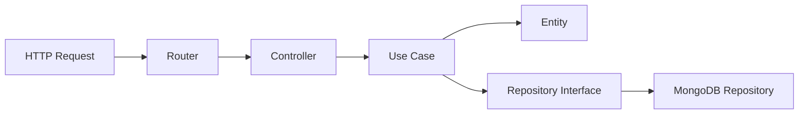

# Clean Architecture Mapping: Project Structure Analysis

## Project Structure Overview

```
── Dockerfile
├── combined.log
├── error.log
├── index.js
├── package.json
├── src
│   ├── app.js
│   ├── entities
│   │   └── user.js
│   ├── errors
│   │   ├── domain-errors.js
│   │   └── repository-errors.js
│   ├── http
│   │   └── router.js
│   ├── mongodb
│   │   └── connection.js
│   ├── repositories
│   │   └── user-repository.js
│   └── use-cases
│       ├── create-user.js
│       └── login-user.js
└── tests/
```

## Clean Architecture Layer Mapping

### 1. Domain Layer (Innermost Circle)
**Location in Project:**
```
src/
├── entities/
│   └── user.js
├── errors/
│   └── domain-errors.js
```

**Characteristics:**
- Contains enterprise-wide business rules
- Pure business logic with no external dependencies
- Defines core entities and value objects
- Contains domain-specific validation rules
- Houses business error definitions

**Key Principles:**
- No dependencies on outer layers
- Framework-independent
- Contains the most stable code
- Houses core business rules that rarely change

### 2. Application Layer
**Location in Project:**
```
src/
├── use-cases/
│   ├── create-user.js
│   └── login-user.js
```

**Characteristics:**
- Contains application-specific business rules
- Orchestrates flow between entities
- Defines interfaces for outer layers
- Implements use cases representing user actions

**Key Principles:**
- Depends only on Domain Layer
- Defines interfaces that outer layers must implement
- Contains application flow control
- Coordinates high-level business rules

### 3. Interface Adapters Layer
**Location in Project:**
```
src/
├── repositories/
│   └── user-repository.js
├── http/
│   └── router.js
```

**Characteristics:**
- Converts data between use cases and external formats
- Contains controllers and presenters
- Implements repository interfaces
- Houses API routes and controllers

**Key Principles:**
- Adapts external interfaces to internal formats
- Implements interfaces defined by application layer
- Contains no business rules
- Translates data between layers

### 4. Frameworks & Drivers Layer (Outermost)
**Location in Project:**
```
src/
├── mongodb/
│   └── connection.js
├── app.js
└── index.js
```

**Characteristics:**
- Contains framework implementations
- Houses external service integrations
- Manages application composition
- Handles infrastructure concerns

**Key Principles:**
- Most volatile layer
- Easy to change without affecting inner layers
- Contains all framework-specific code
- Manages technical details

### Support Files
**Location in Project:**
```
├── tests/
│   ├── e2e/
│   └── unit-tests/
├── Dockerfile
├── combined.log
└── error.log
```

**Purpose:**
- Testing infrastructure
- Deployment configuration
- Logging and monitoring
- Development tools

## Dependency Rule Implementation

### 1. Dependency Direction
All dependencies point inward:
```
Frameworks → Interface Adapters → Application → Domain
(Outer)                                        (Inner)
```

### 2. Interface Segregation
```
Domain Layer        → Defines interfaces
Application Layer   → Uses domain interfaces, defines own interfaces
Interface Adapters  → Implements application interfaces
Frameworks Layer    → Provides concrete implementations
```

### 3. Dependency Flow Example


## Clean Architecture Benefits in This Structure

### 1. Independence
- **Framework Independence**: Core business logic is isolated from express/mongodb
- **UI Independence**: Can change API structure without affecting business logic
- **Database Independence**: Can switch databases by implementing new repositories
- **External Independence**: Business rules are isolated from external services

### 2. Testability
- **Domain Layer**: Pure unit tests
- **Use Cases**: Mock repositories and services
- **Interface Adapters**: Test data conversion
- **Framework Layer**: Integration tests

### 3. Maintainability
- Clear separation of concerns
- Independent deployability
- Easier to locate and fix issues
- Simple to add new features

### 4. Scalability
- Independent scaling of components
- Easy to add new use cases
- Simple to implement new interfaces
- Flexible infrastructure changes

## Best Practices for This Structure

### 1. Layer Isolation
- Keep layers strictly separated
- Use interfaces for cross-layer communication
- Maintain inward dependency rule
- Avoid circular dependencies

### 2. Code Organization
- Group by feature within layers
- Keep consistent file naming
- Use clear interface definitions
- Maintain layer boundaries

### 3. Testing Strategy
- Unit tests for business logic
- Integration tests for adapters
- E2E tests for complete flows
- Mock external dependencies

### 4. Error Handling
- Domain-specific errors
- Layer-appropriate error handling
- Clear error boundaries
- Consistent error formatting

### 5. Dependency Injection
- Inject dependencies through constructors
- Use interface-based programming
- Configure dependencies at composition root
- Maintain loose coupling