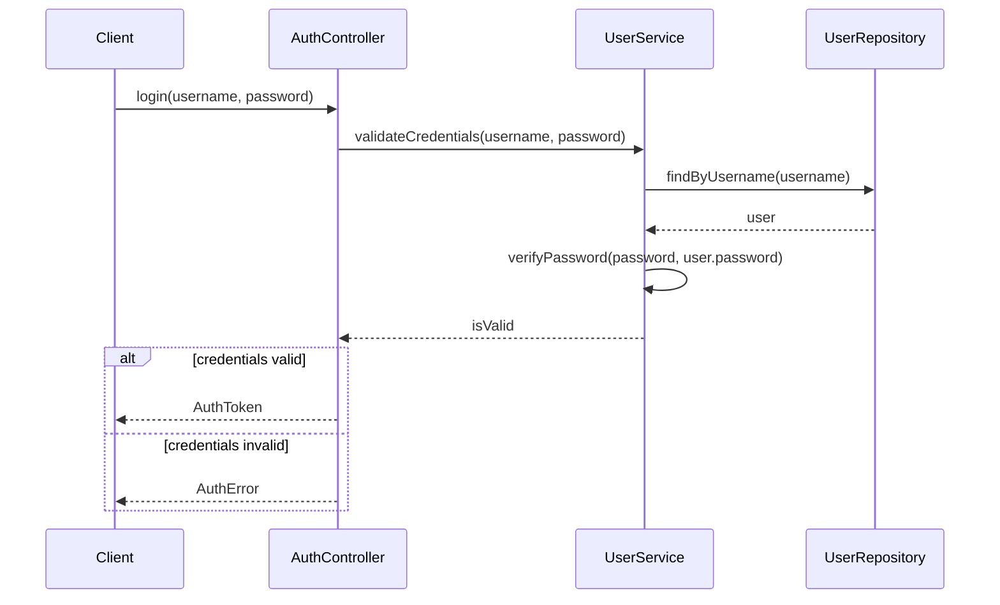

# Proceso de TDD Detallado para Principiantes: Implementando un Diagrama de Secuencia

Vamos a descomponer el proceso de TDD (Test-Driven Development) para alguien que está comenzando a programar, usando como base uno de los diagramas de secuencia que compartimos anteriormente. Este proceso te guiará paso a paso, explicando claramente qué pensar en cada etapa.

## El Diagrama de Secuencia que Implementaremos

Usaremos como ejemplo el diagrama de secuencia para la validación de usuario:



## Proceso Mental Paso a Paso para TDD

### 1. ENTENDER EL DIAGRAMA DE SECUENCIA

**Proceso mental para principiantes:**

"Veo que hay diferentes componentes en el diagrama:
- Client: quien inicia la petición de login
- AuthController: quien recibe la petición y coordina el proceso
- UserService: quien maneja la lógica de validación
- UserRepository: quien busca los datos del usuario

El flujo parece ser:
1. El cliente intenta hacer login con usuario y contraseña
2. El controlador pide validar las credenciales al servicio
3. El servicio busca al usuario en el repositorio
4. El servicio verifica la contraseña
5. Dependiendo del resultado, se devuelve un token o un error"

**Reflexión inicial:**
"Me enfocaré primero en el UserService, que parece tener la lógica principal. Según el diagrama, este servicio debe:
- Buscar un usuario por nombre de usuario
- Verificar si la contraseña es correcta
- Devolver si las credenciales son válidas o no"

### 2. PLANIFICAR LAS PRUEBAS BASADAS EN EL DIAGRAMA

**Proceso mental para principiantes:**

"Basándome en el diagrama, necesito probar varios escenarios para el UserService:
1. Cuando el usuario existe y la contraseña es correcta → debe devolver verdadero
2. Cuando el usuario existe pero la contraseña es incorrecta → debe devolver falso
3. Cuando el usuario no existe → debe manejar este caso sin errores

Para hacer estas pruebas, necesitaré:
- Simular (mockear) el UserRepository para controlar lo que devuelve
- Crear el UserService para probarlo
- Probar cada escenario por separado"

### 3. ESCRIBIR LA PRIMERA PRUEBA (RED)

**Proceso mental para principiantes:**

"Empezaré con el caso más básico y positivo: cuando el usuario existe y la contraseña es correcta."

```javascript
// userService.test.js
const UserService = require('./userService');

describe('UserService - validateCredentials', () => {
  // Antes de cada prueba, preparo el entorno
  let userService;
  let mockUserRepository;
  
  beforeEach(async () => {
    // Creo un mock del repositorio
    mockUserRepository = {
      findByUsername: jest.fn()
    };
    
    // Creo el servicio con el repositorio mock
    userService = new UserService(mockUserRepository);
  });
  
  test('debe devolver verdadero cuando las credenciales son válidas', async () => {
    // Preparación (ARRANGE):
    // Configuro el mock para que simule un usuario existente
    const username = 'usuario_test';
    const password = 'contraseña123';
    
    // El repositorio devolverá un usuario con contraseña hasheada
    mockUserRepository.findByUsername.mockResolvedValue({
      id: 1,
      username: username,
      password: 'contraseña_hasheada_123' // En realidad, esto sería un hash
    });
    
    // Agrego una función al servicio para verificar la contraseña
    // (Esto normalmente usaría bcrypt, pero lo simplificamos para el ejemplo)
    userService.verifyPassword = jest.fn().mockReturnValue(true);
    
    // Ejecución (ACT):
    // Llamo al método que quiero probar
    const isValid = await userService.validateCredentials(username, password);
    
    // Verificación (ASSERT):
    // Compruebo que se obtiene el resultado esperado
    expect(isValid).toBe(true);
    
    // También verifico que se llamaron los métodos correctos
    expect(mockUserRepository.findByUsername).toHaveBeenCalledWith(username);
    expect(userService.verifyPassword).toHaveBeenCalledWith(password, 'contraseña_hasheada_123');
  });
});
```

**Reflexión después de escribir la prueba:**
"Esta prueba no va a pasar porque aún no he implementado el UserService. Debo ejecutarla para ver el error específico y entender qué necesito implementar."

### 4. EJECUTAR LA PRUEBA Y VER QUE FALLA (RED)

**Proceso mental para principiantes:**

"Al ejecutar la prueba, recibo un error porque el módulo UserService no existe. Esto es esperado en TDD, ya que primero escribimos la prueba y luego la implementación."

### 5. IMPLEMENTAR EL CÓDIGO MÍNIMO (GREEN)

**Proceso mental para principiantes:**

"Ahora necesito crear la implementación más simple posible para que la prueba pase."

```javascript
// userService.js
class UserService {
  constructor(userRepository) {
    this.userRepository = userRepository;
  }
  
  async validateCredentials(username, password) {
    // Buscar el usuario por nombre de usuario
    const user = await this.userRepository.findByUsername(username);
    
    // Verificar la contraseña
    const isValid = this.verifyPassword(password, user.password);
    
    return isValid;
  }
  
  // En una implementación real, esta función usaría bcrypt
  // para comparar la contraseña con el hash almacenado
  verifyPassword(password, storedPassword) {
    // Implementación simplificada para el ejemplo
    return password === 'contraseña123' && storedPassword === 'contraseña_hasheada_123';
  }
}

module.exports = UserService;
```

**Reflexión sobre la implementación:**
"Este código es muy simple y específico para la prueba, pero es suficiente para que pase. En TDD, empezamos con lo mínimo necesario y luego mejoramos el código."

### 6. EJECUTAR LA PRUEBA NUEVAMENTE (GREEN)

**Proceso mental para principiantes:**

"Ahora la prueba debería pasar porque he implementado el código necesario. Esto confirma que mi implementación cumple con el caso de prueba básico."

### 7. ESCRIBIR LA SEGUNDA PRUEBA (RED)

**Proceso mental para principiantes:**

"Ahora probaré el segundo caso: cuando el usuario existe pero la contraseña es incorrecta."

```javascript
// Añadir a userService.test.js
test('debe devolver falso cuando la contraseña es incorrecta', async () => {
  // Preparación:
  const username = 'usuario_test';
  const password = 'contraseña_incorrecta';
  
  mockUserRepository.findByUsername.mockResolvedValue({
    id: 1,
    username: username,
    password: 'contraseña_hasheada_123'
  });
  
  // Modifico el mock para que devuelva falso esta vez
  userService.verifyPassword = jest.fn().mockReturnValue(false);
  
  // Ejecución:
  const isValid = await userService.validateCredentials(username, password);
  
  // Verificación:
  expect(isValid).toBe(false);
  expect(mockUserRepository.findByUsername).toHaveBeenCalledWith(username);
  expect(userService.verifyPassword).toHaveBeenCalledWith(password, 'contraseña_hasheada_123');
});
```

**Reflexión:**
"Esta prueba debería pasar sin cambios en el código, ya que mi implementación actual ya maneja este caso. Pero es importante tener una prueba específica para cada comportamiento."

### 8. EJECUTAR LA PRUEBA (GREEN)

**Proceso mental para principiantes:**

"La prueba pasa porque mi implementación ya maneja este caso. Esto es bueno, aunque no tuve que modificar el código."

### 9. ESCRIBIR LA TERCERA PRUEBA - CASO BORDE (RED)

**Proceso mental para principiantes:**

"Ahora necesito probar un caso borde importante: ¿qué sucede si el usuario no existe? Mi código actual probablemente fallará porque intenta acceder a user.password, pero si user es null, esto causará un error."

```javascript
// Añadir a userService.test.js
test('debe manejar usuario inexistente', async () => {
  // Preparación:
  const username = 'usuario_inexistente';
  const password = 'cualquier_contraseña';
  
  // Simular que el usuario no existe
  mockUserRepository.findByUsername.mockResolvedValue(null);
  
  // Ejecución:
  const isValid = await userService.validateCredentials(username, password);
  
  // Verificación:
  expect(isValid).toBe(false);
  expect(mockUserRepository.findByUsername).toHaveBeenCalledWith(username);
  // No debería llamar a verifyPassword si el usuario no existe
  expect(userService.verifyPassword).not.toHaveBeenCalled();
});
```

**Reflexión:**
"Esta prueba debería fallar porque mi implementación actual no maneja el caso de usuario inexistente. Necesitaré mejorar el código."

### 10. EJECUTAR LA PRUEBA Y VER QUE FALLA (RED)

**Proceso mental para principiantes:**

"La prueba falla con un error de tipo 'Cannot read property 'password' of null'. Esto es porque estoy intentando acceder a user.password cuando user es null."

### 11. MEJORAR LA IMPLEMENTACIÓN (GREEN)

**Proceso mental para principiantes:**

"Necesito modificar mi código para manejar el caso de usuario inexistente."

```javascript
// userService.js (modificado)
async validateCredentials(username, password) {
  // Buscar el usuario por nombre de usuario
  const user = await this.userRepository.findByUsername(username);
  
  // Verificar que el usuario existe
  if (!user) {
    return false; // Usuario no encontrado, credenciales inválidas
  }
  
  // Verificar la contraseña
  const isValid = this.verifyPassword(password, user.password);
  
  return isValid;
}
```

**Reflexión:**
"Esta implementación mejorada maneja el caso de usuario inexistente. Ahora la prueba debería pasar."

### 12. EJECUTAR TODAS LAS PRUEBAS (GREEN)

**Proceso mental para principiantes:**

"Todas las pruebas pasan, lo que significa que mi implementación maneja los tres casos: credenciales válidas, contraseña incorrecta y usuario inexistente."

### 13. REFACTORIZAR EL CÓDIGO

**Proceso mental para principiantes:**

"Ahora que tengo pruebas que funcionan, puedo mejorar mi código sin miedo a romperlo. Voy a hacer el método verifyPassword más realista usando bcrypt."

```javascript
// userService.js (refactorizado)
const bcrypt = require('bcrypt');

class UserService {
  constructor(userRepository) {
    this.userRepository = userRepository;
  }
  
  async validateCredentials(username, password) {
    // Buscar el usuario por nombre de usuario
    const user = await this.userRepository.findByUsername(username);
    
    // Verificar que el usuario existe
    if (!user) {
      return false; // Usuario no encontrado, credenciales inválidas
    }
    
    // Verificar la contraseña usando bcrypt
    const isValid = await this.verifyPassword(password, user.password);
    
    return isValid;
  }
  
  async verifyPassword(password, hashedPassword) {
    // Usar bcrypt para comparar la contraseña con el hash
    try {
      return await bcrypt.compare(password, hashedPassword);
    } catch (error) {
      console.error('Error al verificar la contraseña:', error);
      return false; // En caso de error, consideramos las credenciales inválidas
    }
  }
}

module.exports = UserService;
```

**Reflexión:**
"Este código es más robusto y realista. Ahora debo modificar mis pruebas para que funcionen con la nueva implementación."

### 14. ADAPTAR LAS PRUEBAS A LA REFACTORIZACIÓN

**Proceso mental para principiantes:**

"Necesito cambiar mis pruebas para que funcionen con la nueva implementación que usa bcrypt."

```javascript
// userService.test.js (modificado)
const bcrypt = require('bcrypt');
const UserService = require('./userService');

describe('UserService - validateCredentials', () => {
  let userService;
  let mockUserRepository;
  
  beforeEach(async () => {
    mockUserRepository = {
      findByUsername: jest.fn()
    };
    
    userService = new UserService(mockUserRepository);
  });
  
  test('debe devolver verdadero cuando las credenciales son válidas', async () => {
    const username = 'usuario_test';
    const password = 'contraseña123';
    const hashedPassword = await bcrypt.hash(password, 10);
    
    mockUserRepository.findByUsername.mockResolvedValue({
      id: 1,
      username: username,
      password: hashedPassword
    });
    
    const isValid = await userService.validateCredentials(username, password);
    
    expect(isValid).toBe(true);
    expect(mockUserRepository.findByUsername).toHaveBeenCalledWith(username);
  });
  
  test('debe devolver falso cuando la contraseña es incorrecta', async () => {
    const username = 'usuario_test';
    const correctPassword = 'contraseña123';
    const wrongPassword = 'contraseña_incorrecta';
    const hashedPassword = await bcrypt.hash(correctPassword, 10);
    
    mockUserRepository.findByUsername.mockResolvedValue({
      id: 1,
      username: username,
      password: hashedPassword
    });
    
    const isValid = await userService.validateCredentials(username, wrongPassword);
    
    expect(isValid).toBe(false);
    expect(mockUserRepository.findByUsername).toHaveBeenCalledWith(username);
  });
  
  test('debe manejar usuario inexistente', async () => {
    const username = 'usuario_inexistente';
    const password = 'cualquier_contraseña';
    
    mockUserRepository.findByUsername.mockResolvedValue(null);
    
    const isValid = await userService.validateCredentials(username, password);
    
    expect(isValid).toBe(false);
    expect(mockUserRepository.findByUsername).toHaveBeenCalledWith(username);
  });
});
```

**Reflexión:**
"Estas pruebas son más realistas y prueban la implementación mejorada con bcrypt."

### 15. EJECUTAR TODAS LAS PRUEBAS (GREEN)

**Proceso mental para principiantes:**

"Todas las pruebas deberían pasar con la implementación refactorizada. Esto confirma que mi refactorización no rompió la funcionalidad existente."

### 16. CONTINUAR CON EL SIGUIENTE COMPONENTE: AUTHCONTROLLER

**Proceso mental para principiantes:**

"Ahora que he implementado y probado el UserService, puedo continuar con el AuthController, que según el diagrama debe:
- Recibir una solicitud de login
- Usar el UserService para validar las credenciales
- Devolver un token o un error según el resultado

Seguiré el mismo proceso de TDD para implementarlo."

```javascript
// authController.test.js
const AuthController = require('./authController');

describe('AuthController - login', () => {
  let authController;
  let mockUserService;
  
  beforeEach(async () => {
    // Crear mock del UserService
    mockUserService = {
      validateCredentials: jest.fn()
    };
    
    // Crear AuthController con el UserService mock
    authController = new AuthController(mockUserService);
  });
  
  test('debe devolver un token cuando las credenciales son válidas', async () => {
    // Preparación:
    const username = 'usuario_test';
    const password = 'contraseña123';
    
    // Configurar el mock para que valide las credenciales
    mockUserService.validateCredentials.mockResolvedValue(true);
    
    // Ejecución:
    const result = await authController.login(username, password);
    
    // Verificación:
    expect(mockUserService.validateCredentials).toHaveBeenCalledWith(username, password);
    expect(result.success).toBe(true);
    expect(result.token).toBeDefined();
  });
  
  test('debe devolver un error cuando las credenciales son inválidas', async () => {
    // Preparación:
    const username = 'usuario_test';
    const password = 'contraseña_incorrecta';
    
    // Configurar el mock para que rechace las credenciales
    mockUserService.validateCredentials.mockResolvedValue(false);
    
    // Ejecución:
    const result = await authController.login(username, password);
    
    // Verificación:
    expect(mockUserService.validateCredentials).toHaveBeenCalledWith(username, password);
    expect(result.success).toBe(false);
    expect(result.error).toBe('Credenciales inválidas');
    expect(result.token).toBeUndefined();
  });
});
```

### 17. IMPLEMENTAR AUTHCONTROLLER (GREEN)

**Proceso mental para principiantes:**

"Necesito implementar el AuthController para que las pruebas pasen."

```javascript
// authController.js
const jwt = require('jsonwebtoken');

class AuthController {
  constructor(userService) {
    this.userService = userService;
    this.secretKey = process.env.JWT_SECRET || 'clave_secreta_desarrollo';
  }
  
  async login(username, password) {
    // Validar las credenciales usando UserService
    const isValid = await this.userService.validateCredentials(username, password);
    
    if (isValid) {
      // Generar un token JWT
      const token = this.generateToken(username);
      
      return {
        success: true,
        token: token
      };
    } else {
      // Devolver error si las credenciales son inválidas
      return {
        success: false,
        error: 'Credenciales inválidas'
      };
    }
  }
  
  generateToken(username) {
    // Crear un token JWT con el nombre de usuario
    // En una implementación real, incluiríamos más información como el ID del usuario
    return jwt.sign(
      { username: username },
      this.secretKey,
      { expiresIn: '1h' } // El token expira en 1 hora
    );
  }
}

module.exports = AuthController;
```

**Reflexión:**
"Esta implementación debería pasar las pruebas y completar la funcionalidad según el diagrama de secuencia."

### 18. PRUEBAS DE INTEGRACIÓN

**Proceso mental para principiantes:**

"Ahora que he implementado y probado cada componente por separado, debería crear una prueba de integración que verifique que todo funciona correctamente en conjunto."

```javascript
// integration.test.js
const bcrypt = require('bcrypt');
const AuthController = require('./authController');
const UserService = require('./userService');

describe('Autenticación - Integración', () => {
  let authController;
  let userService;
  let mockUserRepository;
  
  beforeEach(async () => {
    // Crear una base de datos simulada con un usuario
    const testUser = {
      id: 1,
      username: 'usuario_test',
      password: await bcrypt.hash('contraseña123', 10)
    };
    
    // Crear mock del repositorio
    mockUserRepository = {
      findByUsername: jest.fn(username => {
        if (username === testUser.username) {
          return Promise.resolve(testUser);
        }
        return Promise.resolve(null);
      })
    };
    
    // Crear los componentes reales (no mocks)
    userService = new UserService(mockUserRepository);
    authController = new AuthController(userService);
  });
  
  test('flujo completo de autenticación exitosa', async () => {
    // Ejecutar el flujo completo
    const result = await authController.login('usuario_test', 'contraseña123');
    
    // Verificar el resultado
    expect(result.success).toBe(true);
    expect(result.token).toBeDefined();
  });
  
  test('flujo completo de autenticación fallida', async () => {
    // Ejecutar el flujo completo con contraseña incorrecta
    const result = await authController.login('usuario_test', 'contraseña_incorrecta');
    
    // Verificar el resultado
    expect(result.success).toBe(false);
    expect(result.error).toBe('Credenciales inválidas');
  });
  
  test('flujo completo de usuario inexistente', async () => {
    // Ejecutar el flujo completo con usuario inexistente
    const result = await authController.login('usuario_inexistente', 'cualquier_contraseña');
    
    // Verificar el resultado
    expect(result.success).toBe(false);
    expect(result.error).toBe('Credenciales inválidas');
  });
});
```

### 19. REVISIÓN FINAL Y REFLEXIÓN

**Proceso mental para principiantes:**

"He completado la implementación siguiendo el diagrama de secuencia:
1. Implementé UserService para validar credenciales
2. Implementé AuthController para gestionar el login
3. Creé pruebas unitarias para cada componente
4. Creé pruebas de integración para verificar el flujo completo

Mi código:
- Maneja todos los casos del diagrama (credenciales válidas e inválidas)
- Maneja casos borde como usuario inexistente
- Usa técnicas de seguridad como bcrypt para las contraseñas y JWT para los tokens

El proceso de TDD me ayudó a:
- Pensar primero en el comportamiento esperado
- Implementar solo lo necesario
- Tener confianza en mi código gracias a las pruebas
- Refactorizar sin miedo a romper la funcionalidad

Notas para mejorar:
- Podría agregar más validaciones, como verificar el formato del nombre de usuario o contraseña
- Podría mejorar el manejo de errores
- En una aplicación real, conectaría con una base de datos en lugar de usar un repositorio simulado"

## Conclusión

Este proceso detallado muestra cómo aplicar TDD para implementar un sistema de autenticación basado en un diagrama de secuencia. Al seguir el ciclo Red-Green-Refactor y pensar detenidamente en cada paso, puedes crear código robusto y bien probado, incluso como principiante en la programación.

Los aspectos clave para recordar son:
1. Entender el diagrama y los requisitos antes de comenzar
2. Escribir una prueba para un comportamiento específico
3. Implementar el código mínimo para que la prueba pase
4. Refactorizar cuando sea necesario, con la confianza de tener pruebas
5. Repetir el proceso para cada comportamiento
6. Finalmente, verificar la integración de todos los componentes

Este enfoque metódico y paso a paso te ayudará a desarrollar buenos hábitos de programación desde el principio.
